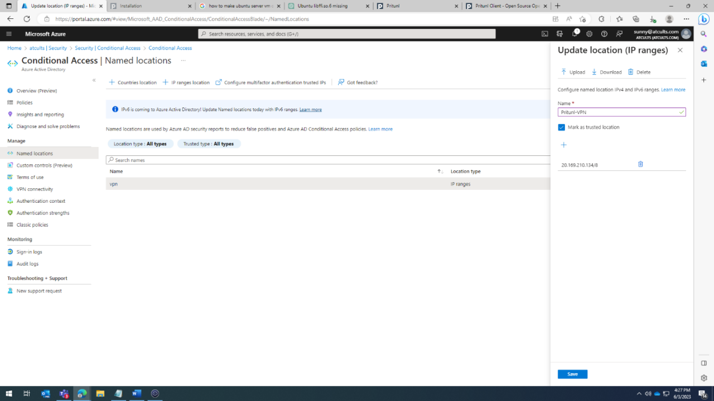
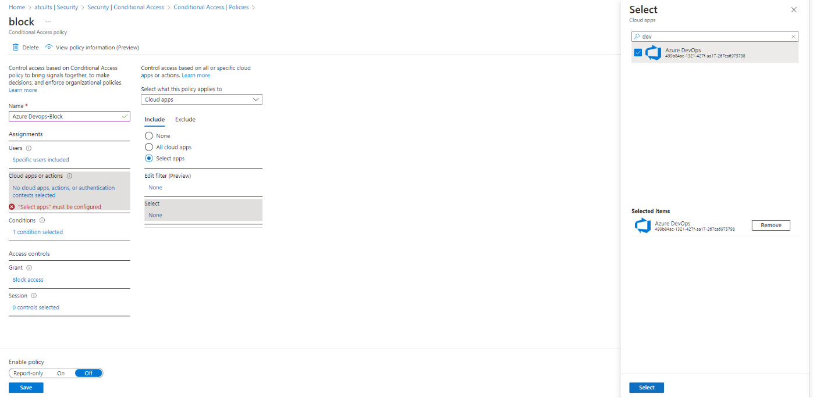
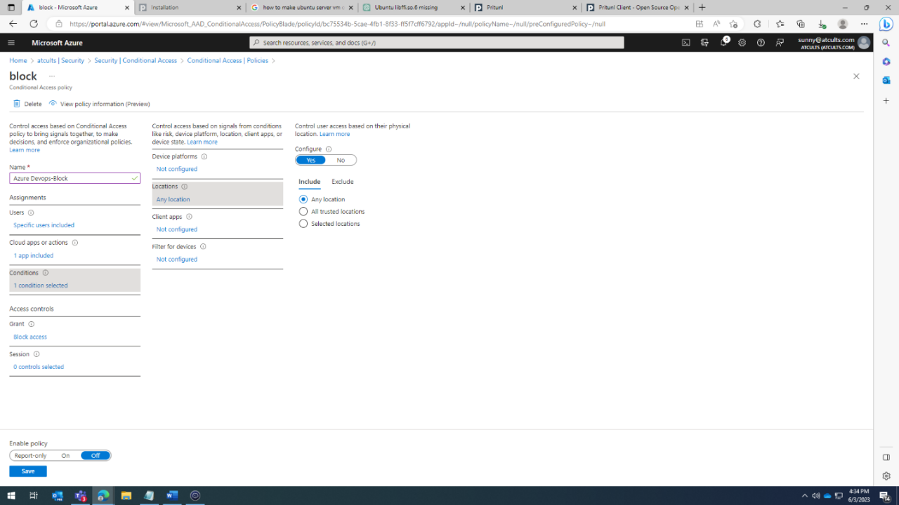
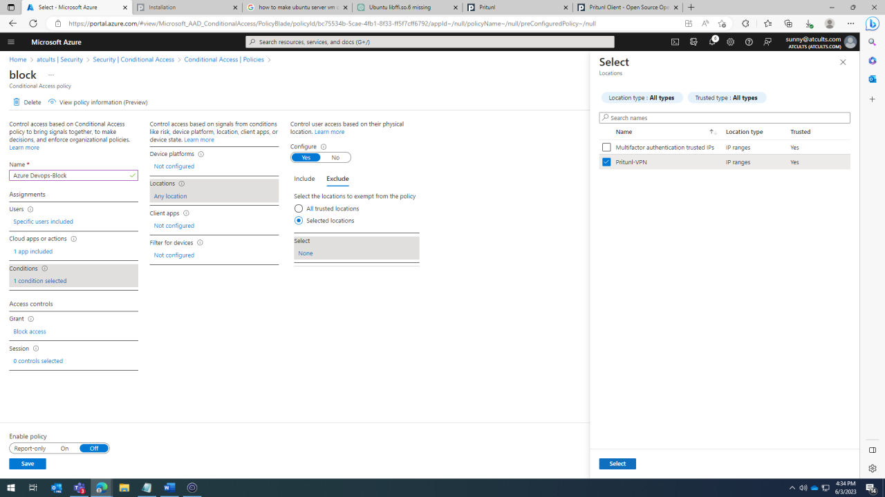
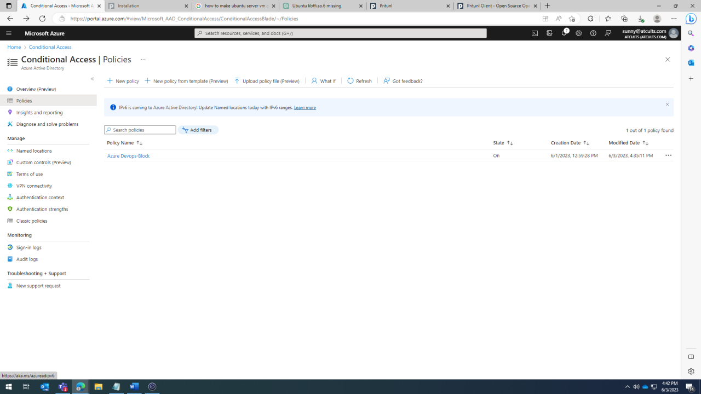
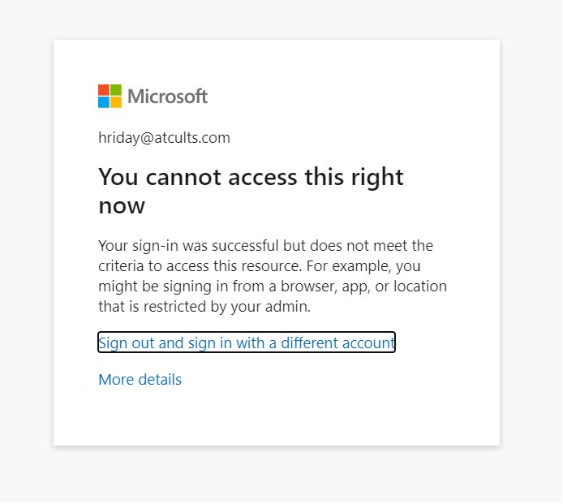

# Pre-requisites Before Setting up Conditional Access in Azure DevOps

To set up Conditional Access in Azure DevOps, you need to complete the following pre-requisites:

1. **Create an Azure DevOps Organization:** Go to https://dev.azure.com/ and sign in with your Microsoft account. If you don't have an account, you can create one. After signing in, create a new Azure DevOps organization.

2. **Create a Project:** Within your new organization, create a new project. Provide a name and description for the project, choose the visibility (public or private), and select a version control (Git or Team Foundation Version Control) and a work item process (Agile, Scrum, or CMMI).

3. **Set Up Repositories:** After creating the project, set up your code repositories. Click on 'Repos' in the sidebar, and then click 'Initialize' to set up the default repository. If you have existing code you wish to import, you can do that instead.

4. **Invite Team Members:** Invite others to your project. Go to 'Project settings' > 'Users' to manage project users and access levels.

5. **Azure Active Directory (AD) Integration:** Ensure that your Azure DevOps organization is connected to your Azure Active Directory (AD) tenant. Azure AD is required for implementing Conditional Access policies. If you created your Azure DevOps organization with a Microsoft account, it might not be connected to Azure AD. You can connect it following the instructions in the Azure DevOps and Azure AD documentation.

6. **Users and Groups:** Identify the users and groups who will be affected by the Conditional Access policies. These could be your project team members or any other individuals or groups who need access to your Azure DevOps repositories. Set up these users and groups in Azure AD if they're not already there.

7. **Multi-Factor Authentication (Optional):** If you want to require multi-factor authentication for access to Azure DevOps, you will need to set up Azure AD Multi-Factor Authentication.

# Azure Conditional Access Setup For Restricting Azure DevOps

To restrict Azure DevOps access using Conditional Access, follow these steps:

1. **Open Azure Portal:** Go to the Azure portal (portal.azure.com) and sign in.

2. **Navigate to Azure Active Directory:** From the left-hand menu, select "Azure Active Directory".

3. **Navigate to Named Locations:** Under "Security", select "Named locations".

4. **Add a New Named Location:** Click "+ New location".

5. **Configure Named Location:** Provide a name for the location. Then, configure it by IP range or by country/region. For IP ranges, click "IP Ranges" and enter the IP ranges of your virtual machine Public IP. Once done, click "Create".

6. **Create Conditional Access Policy:** Go back to "Security" and select "Conditional Access". Then, click "+ New policy".

7. **Name the Policy:** Give your new policy a name.

8. **Set Users and Groups:** Under "Assignments" > "Users and groups", select the users or groups that the policy will apply to.

9. **Set Cloud Apps or Actions:** Under "Assignments", go to "Cloud apps or actions". Select "Azure DevOps" from the list of available applications.

10. **Configure Conditions:** Go to "Conditions" > "Locations". Here, select "Include Any Location" and "Exclude" the named location you created.

11. **Configure Access Controls:** Under "Access controls", set up the controls that will be enforced when the conditions of the policy are met.

12. **Enable the Policy:** Ensure the policy is set to "On" under "Enable policy".

13. **Save the Policy:** Click "Create" to save and enable the policy.

# Testing

Test the Conditional Access setup with the following cases:

**Case 1: When VPN is not connected:**

Step 1: Sign in to your Azure DevOps organization.

**Case 2: When connected to VPN:**

Step 1: Attempt to Sign in to your Azure DevOps organization again.

Please note: The content provided above is in English language as requested.