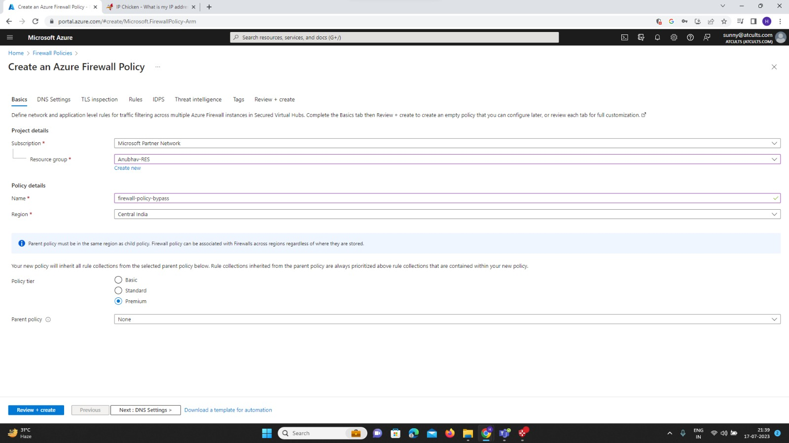
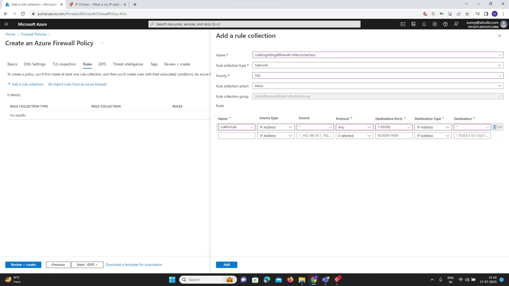
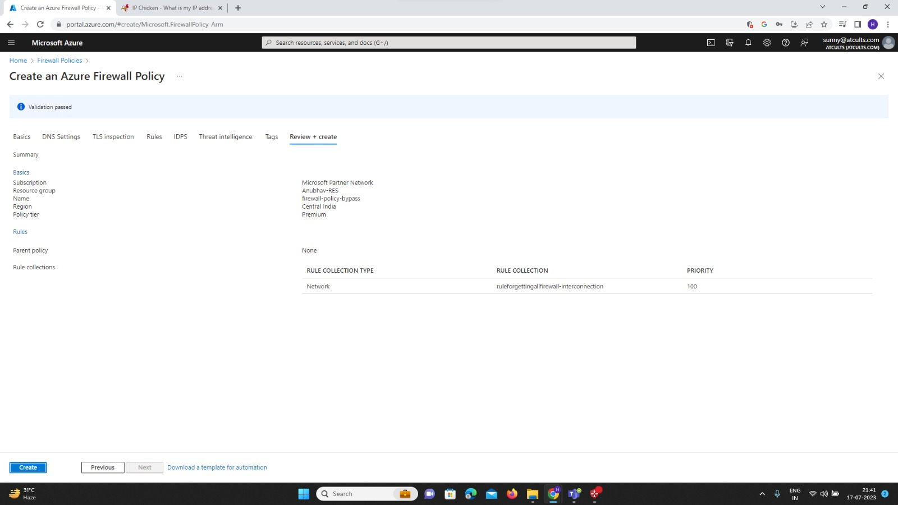

# Azure Firewall Policy Documentation

## Table of Contents
1. Introduction
2. Prerequisites
3. Creating an Azure Firewall Policy
   - 3.1. Sign in to the Azure Portal
   - 3.2. Navigate to Firewall Policy
   - 3.3. Create a New Azure Firewall Policy
   - 3.4. Configure Rule Collections
   - 3.5. Associate Azure Firewall with the Policy
4. Applying the Firewall Policy
5. Modifying the Firewall Policy
6. Deleting a Firewall Policy
7. Best Practices
8. Conclusion

## 1. Introduction
Azure Firewall Policy is a service in Microsoft Azure that allows you to centrally manage and enforce firewall rules for your virtual networks. It provides a scalable and flexible way to control network traffic across your Azure resources. This document will guide you through the steps to create an Azure Firewall Policy, define rule collections, and associate the policy with Azure Firewall instances.

## 2. Prerequisites
Before you proceed with creating an Azure Firewall Policy, ensure you have the following:

- An Azure subscription with sufficient permissions to create and manage resources.
- Knowledge of virtual networks and Azure Firewall concepts.
- Access to the Azure Portal (https://portal.azure.com).

## 3. Creating an Azure Firewall Policy

### 3.1. Sign in to the Azure Portal
1. Open your web browser and navigate to https://portal.azure.com.
2. Sign in with your Azure account credentials.

### 3.2. Navigate to Firewall Policy
1. In the Azure Portal, click on "All services" in the left-hand menu.
2. Type "Firewall Policy" in the search bar and select "Firewall Policy" from the results.

### 3.3. Create a New Azure Firewall Policy
1. In the "Firewall Policy" blade, click on the "+ Add" button to create a new policy.

2. In the "Basics" tab of the "Create Firewall Policy" page, provide the following details:
   - **Subscription**: Select the subscription where you want to create the policy.
   - **Resource group**: Choose an existing resource group or create a new one for the policy.
   - **Name**: Enter a unique name for the policy.
   - **Region**: Select the Azure region where the policy should be created.
   - **Priority**: Set the priority for the policy. Lower values have higher priority (1 being the highest).

3. Click on the "Review + create" button to validate your settings and then click "Create" to create the policy.

### 3.4. Configure Rule Collections
1. In the newly created Firewall Policy blade, click on "Rule collections" in the left-hand menu.
2. Click on "+ Add" to create a new rule collection.
3. In the "Create rule collection" page, provide the following details:
   - **Name**: Enter a descriptive name for the rule collection.
   - **Rule priority**: Set the priority for the rule collection. Rules within a collection are processed in ascending order based on priority.

4. Under "Rules within this collection," click on "+ Add" to add new rules to the collection.
5. In the "Add rule" page, configure the rule with the necessary properties such as:
   - **Name**: Give a name to the rule for identification.
   - **Rule type**: Select the rule type (Application rule, Network rule, or NAT rule).
   - **Rule action**: Choose whether to allow or deny traffic matching this rule.
   - **Rule sources and destinations**: Define the source and destination IP addresses/ranges, FQDNs, or Application Security Groups (ASGs) for the rule.
   - **Rule protocols and ports**: Specify the protocols and ports for the rule.
   - **Rule rule-priority**: Set the rule priority within the collection. Lower values have higher priority (1 being the highest).
6. Click "Add" to add the rule to the collection.
7. Repeat steps 4-6 to add more rules to the collection if needed.
8. Click "OK" to save the rule collection.

### 3.5. Associate Azure Firewall with the Policy
1. In the Azure Portal, navigate to the "Azure Firewall" service.
2. Select the Azure Firewall instance you want to associate with the newly created policy.
3. In the Firewall blade, click on "Firewall Policy" in the left-hand menu.
4. Click on "Associate" and choose the previously created Firewall Policy from the list.
5. Click "OK" to associate the policy with the Azure Firewall instance.

## 4. Applying the Firewall Policy
Once you have created the Azure Firewall Policy and associated it with an Azure Firewall instance, the policy's rule collections will start controlling the network traffic as per the defined rules. Any changes made to the policy will be automatically applied to the associated firewall.

## 5. Modifying the Firewall Policy
To modify an existing Firewall Policy, follow these steps:
1. In the Azure Portal, navigate to the "Firewall Policy" service.
2. Select the Firewall Policy you want to modify.
3. Make the necessary changes to the rule collections or rules.
4. Click "Save" to apply the changes to the policy.

## 6. Deleting a Firewall Policy
To delete a Firewall Policy, follow these steps:
1. In the Azure Portal, navigate to the "Firewall Policy" service.
2. Select the Firewall Policy you want to delete.
3. Click on the "Delete" button in the top toolbar.
4. Confirm the deletion when prompted.

## 7. Best Practices
- Regularly review and update your Firewall Policy to accommodate changes in your network and security requirements.
- Use descriptive names for rule collections and rules to enhance readability and manageability.
- Use rule priorities wisely to ensure the correct order of rule processing.
- Avoid overly permissive rules and follow the principle of least privilege.

## 8. Conclusion
Congratulations! You have successfully created an Azure Firewall Policy and associated it with an Azure Firewall instance. By following the best practices and keeping your policy up-to-date, you can effectively control network traffic and enhance the security of your Azure resources.