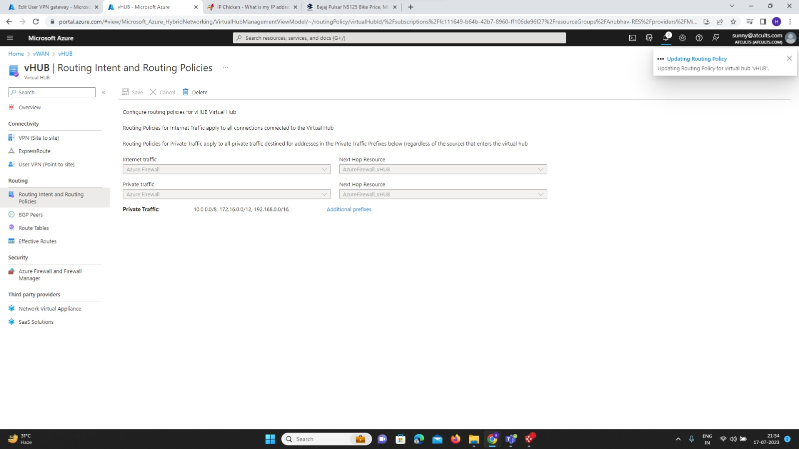
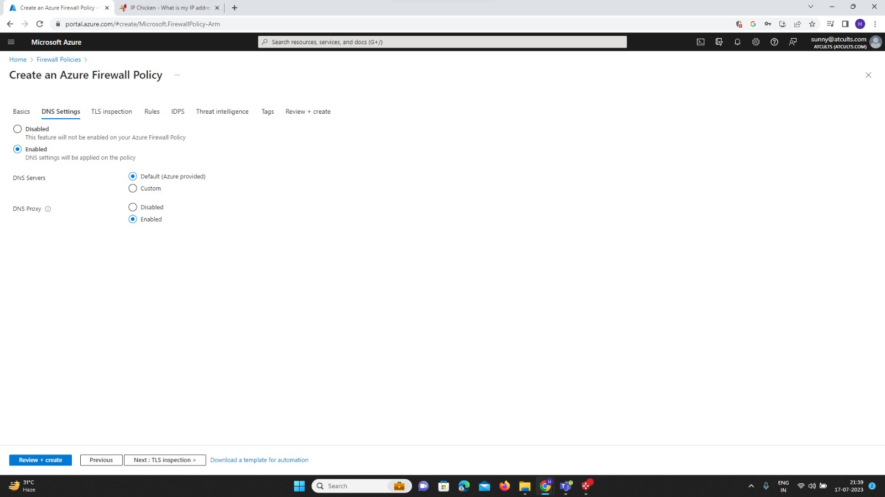
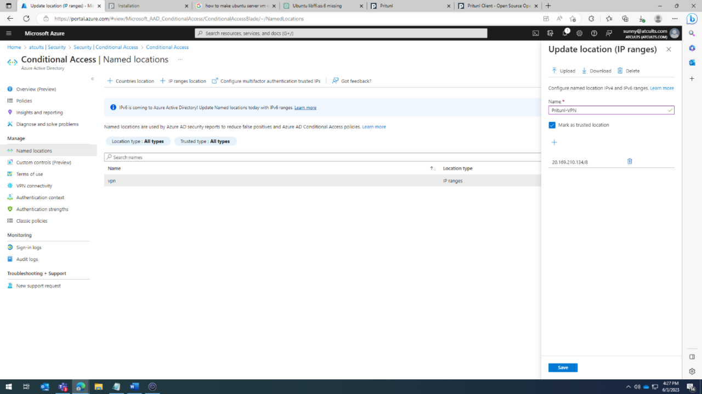
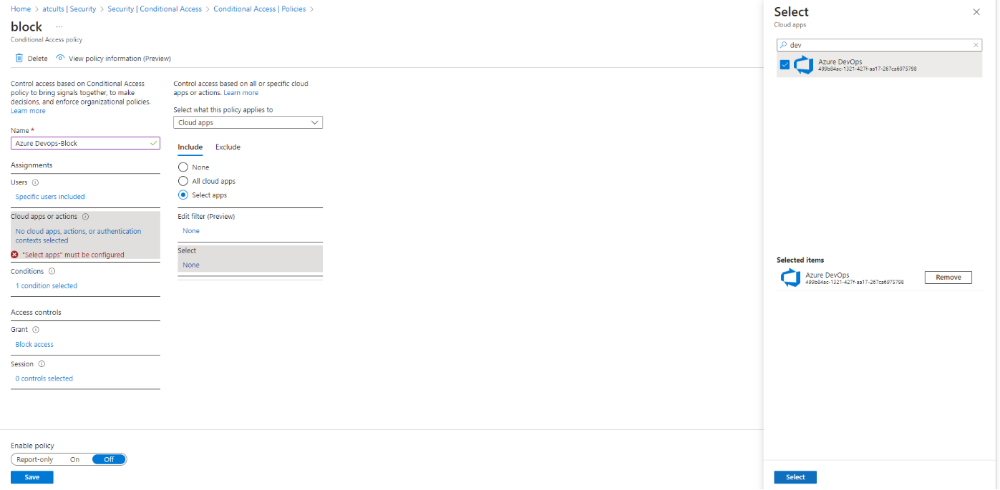
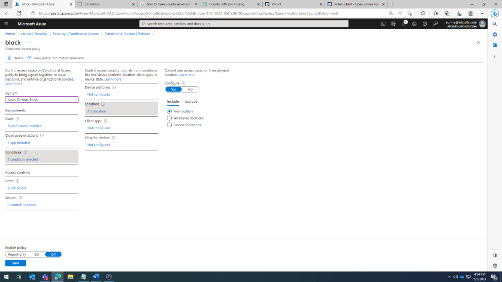
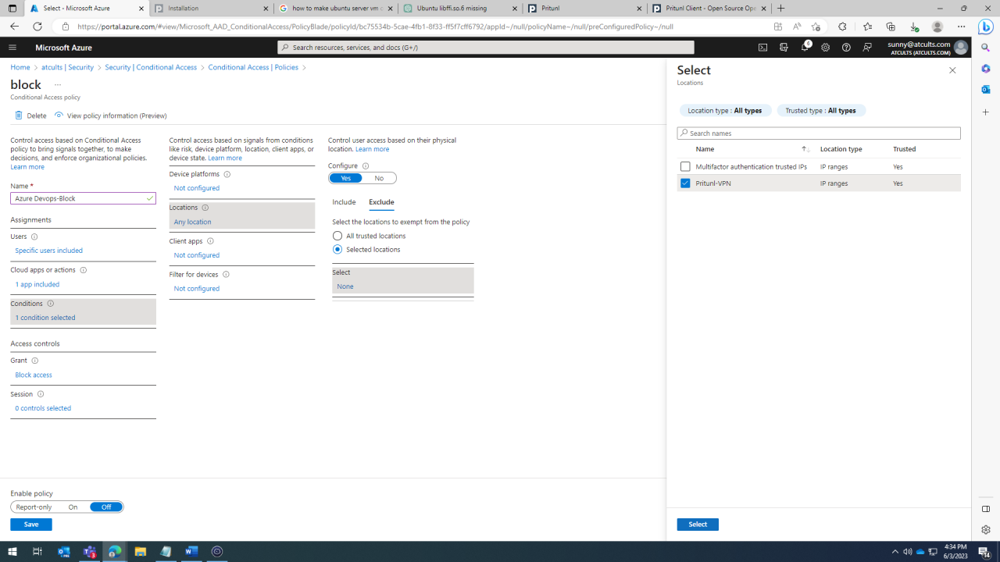
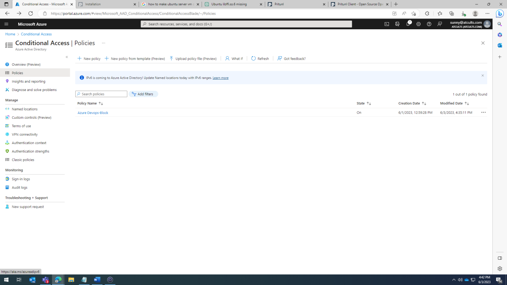

# Creating Azure vHub, Azure Firewall, and Firewall Manager Documentation

## Table of Contents
1. Introduction
2. Prerequisites
3. Creating an Azure Virtual WAN (vHub)
   - 3.1. Sign in to the Azure Portal
   - 3.2. Create a Virtual WAN Resource
   - 3.3. Create a vHub
   - 3.4. Create a User VPN configuration
4. Creating an Azure Firewall
   - 4.1. Sign in to the Azure Portal
   - 4.2. Create an Azure Firewall Resource
   - 4.3. Configure Firewall Rules
5. Implementing Azure Firewall Manager
   - 5.1. Sign in to the Azure Portal
   - 5.2. Create a Firewall Manager Policy
   - 5.3. Associate Firewall Policy with Firewall Instances
6. Conclusion

## 1. Introduction
This documentation provides a step-by-step guide to creating an Azure Virtual WAN (vHub), deploying an Azure Firewall, and implementing Azure Firewall Manager to centrally manage and enforce firewall policies across multiple Azure Firewall instances.

## 2. Prerequisites
Before you proceed, ensure you have the following prerequisites:

- An Azure subscription with sufficient permissions to create and manage resources.
- Basic understanding of Azure networking concepts, including Virtual Networks, Subnets, and Virtual WAN.

## 3. Creating an Azure Virtual WAN (vHub)

### 3.1. Sign in to the Azure Portal
1. Open your web browser and navigate to https://portal.azure.com.
2. Sign in with your Azure account credentials.

### 3.2. Create a Virtual WAN Resource
1. In the Azure Portal, click on "Create a resource" and search for "Virtual WAN."
2. Click on "Virtual WAN" from the search results.
3. In the "Virtual WAN" blade, click on the "+ Add" button.
4. Provide the required details for the Virtual WAN, such as:
   - **Subscription**: Select the subscription for the Virtual WAN.
   - **Resource group**: Choose an existing resource group or create a new one.
   - **Name**: Enter a unique name for the Virtual WAN.
   - **Region**: Select the region where the Virtual WAN should be deployed.
   - **Hub type**: Choose "Standard" as the hub type.
5. Click "Review + create" to validate your settings, and then click "Create" to create the Virtual WAN.


### 3.3. Create a vHub
1. In the Azure Portal, navigate to the newly created Virtual WAN resource.
2. In the "Overview" blade, click on "Virtual hubs" in the left-hand menu.
3. Click on "+ Add" to create a new vHub.


4. In the "Create virtual hub" page, provide the following details:
   - **Name**: Enter a unique name for the vHub.
   - **Hub Virtual Network**: Select the Virtual Network to which the vHub will connect.
   - **Hub Subnet**: Choose the subnet within the selected Virtual Network for the vHub.
   - **Address space**: Define the address space for the vHub in CIDR notation.
   - **SKU**: Choose the desired SKU for the vHub (e.g., Standard, HighPerformance).
5. Click "Create" to create the vHub.

### 3.4. Create a User VPN configuration


A User VPN configuration defines the parameters for connecting remote clients. It's important to create the User VPN configuration before configuring your virtual hub with P2S settings, as you must specify the User VPN configuration you want to use.

1. Navigate to your **Virtual WAN ->User VPN configurations** page and click **+Create user VPN config**.


1. On the **Basics** page, specify the parameters.


    * **Configuration name** - Enter the name you want to call your User VPN Configuration.
    * **Tunnel type** - Select OpenVPN from the dropdown menu.

1. Click **Azure Active Directory** to open the page.


    Toggle **Azure Active Directory** to **Yes** and supply the following values based on your tenant details. You can view the necessary values on the Azure Active Directory page for Enterprise applications in the portal.
   * **Authentication method** - Select Azure Active Directory.
   * **Audience** - Type in the Application ID of the [Azure VPN](openvpn-azure-ad-tenant.md) Enterprise Application registered in your Azure AD tenant.
   * **Issuer** - `https://sts.windows.net/<your Directory ID>/`
   * **AAD Tenant:** TenantID for the Azure AD tenant. Make sure there is no `/` at the end of the AAD tenant URL. 

     * Enter `https://login.microsoftonline.com/{AzureAD TenantID}` for Azure Public AD
     * Enter `https://login.microsoftonline.us/{AzureAD TenantID}` for Azure Government AD
     * Enter `https://login-us.microsoftonline.de/{AzureAD TenantID}` for Azure Germany AD
     * Enter `https://login.chinacloudapi.cn/{AzureAD TenantID}` for China 21Vianet AD

1. Click **Create** to create the User VPN configuration. You'll select this configuration later in the exercise.


    
<!-- ## <a name="site"></a>Create an empty hub

For this exercise, we create an empty virtual hub in this step and, in the next section, you add a P2S gateway to this hub. However, you can combine these steps and create the hub with the P2S gateway settings all at once. The result is the same either way. After configuring the settings, click **Review + create** to validate, then **Create**.


[!INCLUDE [Create an empty hub](../../includes/virtual-wan-hub-basics.md)] -->

## <a name="hub"></a>Add a P2S gateway to a hub

This section shows you how to add a gateway to an already existing virtual hub. This step can take up to 30 minutes for the hub to complete updating. 


1. Navigate to the **Hubs** page under the virtual WAN.
1. Click the name of the hub that you want to edit to open the page for the hub.
1. Click **Edit virtual hub** at the top of the page to open the **Edit virtual hub** page.
1. On the **Edit virtual hub** page, check the checkboxes for **Include vpn gateway for vpn sites** and **Include point-to-site gateway** to reveal the settings. Then configure the values.


   * **Gateway scale units**: Select the Gateway scale units. Scale units represent the aggregate capacity of the User VPN gateway. If you select 40 or more gateway scale units, plan your client address pool accordingly. For information about how this setting impacts the client address pool, see [About client address pools](about-client-address-pools.md). For information about gateway scale units, see the [FAQ](virtual-wan-faq.md#for-user-vpn-point-to-site--how-many-clients-are-supported).
   * **User VPN configuration**: Select the configuration that you created earlier.
   * **User Groups to Address Pools Mapping**: For information about this setting, see [Configure user groups and IP address pools for P2S User VPNs (preview)](user-groups-create.md).

1. After configuring the settings, click **Confirm** to update the hub. It can take up to 30 minutes to update a hub.



## <a name="download-profile"></a>Download User VPN profile

All of the necessary configuration settings for the VPN clients are contained in a VPN client configuration zip file. The settings in the zip file help you easily configure the VPN clients. The VPN client configuration files that you generate are specific to the User VPN configuration for your gateway. You can download global (WAN-level) profiles, or a profile for a specific hub. For information and additional instructions, see [Download global and hub profiles](global-hub-profile.md). The following steps walk you through downloading a global WAN-level profile.

[!INCLUDE [Download profile](../../includes/virtual-wan-p2s-download-profile-include.md)]

##  <a name="configure-client"></a>Configure User VPN clients

Each computer that connects must have a client installed. You configure each client by using the VPN User client profile files that you downloaded in the previous steps. Use the article that pertains to the operating system that you want to connect.

### To configure macOS VPN clients (Preview)

For **macOS** client instructions, see [Configure a VPN client - macOS (Preview)](openvpn-azure-ad-client-mac.md).

### To configure Windows VPN clients

[!INCLUDE [Download Azure VPN client](../../includes/vpn-gateway-download-vpn-client.md)]

#### <a name="import"></a>To import a VPN client profile (Windows)

Sure! Here's a step-by-step procedure to connect and import a VPN client profile from an Azure VPN client:

1. **Install Azure VPN Client:**
   If you haven't already installed the Azure VPN client on your computer, you can download and install it from the official Microsoft website.

2. **Launch Azure VPN Client:**
   After the installation is complete, launch the Azure VPN client on your computer. It should be available in your list of applications or system tray.

3. **Sign in to Azure:**
   Sign in to your Azure account using your credentials. Make sure you have the necessary permissions to access VPN resources in your Azure subscription.

4. **Navigate to VPN Gateway:**
   In the Azure VPN client, navigate to the "VPN Gateway" section. Here, you'll find a list of VPN gateways associated with your Azure account.

5. **Select the VPN Gateway:**
   Choose the VPN gateway that you want to connect to and import the profile for. You may have multiple VPN gateways if you have set up several VPN connections in Azure.

6. **Download the VPN Client Profile:**
   Once you have selected the VPN gateway, look for an option to download the VPN client profile. This profile will contain the necessary configuration information for your VPN connection.

7. **Save the Profile to a Local Location:**
   Save the downloaded VPN client profile to a location on your local computer where you can easily access it.

8. **Import the VPN Client Profile:**
   In the Azure VPN client, there should be an option to import a VPN client profile. Click on it and browse to the location where you saved the downloaded profile. Select the profile and import it into the Azure VPN client.

9. **Configure VPN Connection Settings (if needed):**
   Depending on your network setup and requirements, you might need to configure some additional VPN connection settings. These settings might include authentication methods, encryption, or proxy configurations. Consult your network administrator or the Azure documentation for specific requirements.

   Sure! I've added the step to include the specified routes in the VPN client profile configuration:

```markdown
# Setup the config file in azurevpnconfig 

1. **Open the VPN Client Profile:**
   Use a text editor to open the downloaded VPN client profile.

2. **Add the Route Configuration:**
   Find the `<clientconfig>` section in the VPN client profile. Within the `<includeroutes>` tag, add the following routes:

   ```xml
    <route>
      <destination>0.0.0.0</destination>
      <mask>1</mask>
    </route>
    <route>
      <destination>128.0.0.0</destination>
      <mask>1</mask>
    </route>
   ```

   These routes will include all traffic to the VPN client ( VPN Client to Azure Firewall ).

10. **Save the Changes:**
    After adding the route configuration, save the changes to the VPN client profile.

11. **Import the Updated VPN Client Profile:**
    In the Azure VPN client, there should be an option to import a VPN client profile. Click on it and browse to the location where you saved the updated profile. Select the profile and import it into the Azure VPN client.

12. **Configure VPN Connection Settings (if needed):**
    Depending on your network setup and requirements, you might need to configure some additional VPN connection settings. These settings might include authentication methods, encryption, or proxy configurations. Consult your network administrator or the Azure documentation for specific requirements.

13. **Connect to the VPN:**
    After successfully importing the VPN client profile and configuring any necessary settings, you should be ready to connect to the VPN. Click on the "Connect" or "Start" button in the Azure VPN client to initiate the connection.

14. **Enter Credentials (if prompted):**
    If your VPN connection requires authentication, enter the necessary credentials (username and password) when prompted.

15. **Connected!**
    Once the VPN connection is established, you should see a confirmation message in the Azure VPN client indicating that you are connected to the VPN gateway.

That's it! You have successfully connected to the VPN using the Azure VPN client, and the specified routes have been included in the VPN client profile configuration. Now you can securely access resources in your Azure virtual network and any other connected networks.


## 4. Creating an Azure Firewall

### 4.1. Sign in to the Azure Portal
1. Open your web browser and navigate to https://portal.azure.com.
2. Sign in with your Azure account credentials.

### 4.2. Create an Azure Firewall Resource
1. In the Azure Portal, click on "Create a resource" and search for "Firewall."
2. Click on "Azure Firewall" from the search results.
3. In the "Azure Firewall" blade, click on the "+ Add" button.
4. Provide the required details for the Azure Firewall, such as:
   - **Subscription**: Select the subscription for the Azure Firewall.
   - **Resource group**: Choose an existing resource group or create a new one.
   - **Name**: Enter a unique name for the Azure Firewall.
   - **Region**: Select the region where the Azure Firewall should be deployed.
   - **Virtual WAN**: Choose the Virtual WAN you created earlier.
   - **Public IP Address**: Create a new Public IP Address resource or select an existing one.


5. Click "Review + create" to validate your settings, and then click "Create" to deploy the Azure Firewall.

### 4.3. Configure Firewall Rules
1. In the Azure Portal, navigate to the newly created Azure Firewall resource.
2. In the "Overview" blade, click on "Firewall rules" in the left-hand menu.
3. Click on "+ Add" to create a new Firewall rule.
4. In the "Add rule" page, provide the following details:
   - **Name**: Enter a descriptive name for the rule.
   - **Priority**: Set the priority for the rule. Lower values have higher priority (1 being the highest).
   - **Rule Type**: Choose the rule type (Application rule, Network rule, or NAT rule).
   - **Rule Action**: Choose whether to allow or deny traffic matching this rule.
   - **Rule Name**: Provide the specific rule details, depending on the rule type selected.
   - **Rule Collection**: If needed, assign the rule to a specific rule collection.
5. Click "Add" to create the Firewall rule.

    

6. Repeat steps 3-5 to add more Firewall rules if needed.

## 5. Implementing Azure Firewall Manager

### 5.1. Sign in to the Azure Portal
1. Open your web browser and navigate to https://portal.azure.com.
2. Sign in with your Azure account credentials.

### 5.2. Create a Firewall

 Manager Policy
1. In the Azure Portal, click on "Create a resource" and search for "Firewall Manager."
2. Click on "Firewall Manager" from the search results.
3. In the "Firewall Manager" blade, click on the "+ Add" button.
4. Provide the required details for the Firewall Manager Policy, such as:
   - **Subscription**: Select the subscription for the Firewall Manager Policy.
   - **Resource group**: Choose an existing resource group or create a new one.
   - **Name**: Enter a unique name for the Firewall Manager Policy.
   - **Region**: Select the region where the Firewall Manager Policy should be deployed.

   

5. Click "Review + create" to validate your settings, and then click "Create" to create the Firewall Manager Policy.

### 5.3. Associate Firewall Policy with Firewall Instances
1. In the Azure Portal, navigate to the Firewall Manager Policy you created.
2. In the "Overview" blade, click on "Azure Firewall instances" in the left-hand menu.
3. Click on "+ Add" to associate a new Firewall instance with the policy.
4. In the "Add firewall instance" page, provide the following details:
   - **Subscription**: Select the subscription of the Firewall instance.
   - **Resource group**: Choose the resource group of the Firewall instance.
   - **Firewall**: Select the Azure Firewall resource to associate with the policy.
   - **Region**: Choose the region of the Firewall instance.
5. Click "Add" to associate the Firewall instance with the Firewall Manager Policy.

    

    

    

6. Repeat steps 3-5 to associate more Firewall instances with the policy if needed.

## 6. Conclusion
Congratulations! You have successfully created an Azure Virtual WAN (vHub), deployed an Azure Firewall, and implemented Azure Firewall Manager to centrally manage and enforce firewall policies. By following these steps, you can efficiently secure your Azure network and applications while gaining centralized control over firewall management.


# Pre-requisites Before Setting up Conditional Access in Azure DevOps

To set up Conditional Access in Azure DevOps, you need to complete the following pre-requisites:

1. **Create an Azure DevOps Organization:** Go to https://dev.azure.com/ and sign in with your Microsoft account. If you don't have an account, you can create one. After signing in, create a new Azure DevOps organization.

2. **Create a Project:** Within your new organization, create a new project. Provide a name and description for the project, choose the visibility (public or private), and select a version control (Git or Team Foundation Version Control) and a work item process (Agile, Scrum, or CMMI).

3. **Set Up Repositories:** After creating the project, set up your code repositories. Click on 'Repos' in the sidebar, and then click 'Initialize' to set up the default repository. If you have existing code you wish to import, you can do that instead.

4. **Invite Team Members:** Invite others to your project. Go to 'Project settings' > 'Users' to manage project users and access levels.

5. **Azure Active Directory (AD) Integration:** Ensure that your Azure DevOps organization is connected to your Azure Active Directory (AD) tenant. Azure AD is required for implementing Conditional Access policies. If you created your Azure DevOps organization with a Microsoft account, it might not be connected to Azure AD. You can connect it following the instructions in the Azure DevOps and Azure AD documentation.

6. **Users and Groups:** Identify the users and groups who will be affected by the Conditional Access policies. These could be your project team members or any other individuals or groups who need access to your Azure DevOps repositories. Set up these users and groups in Azure AD if they're not already there.

7. **Multi-Factor Authentication (Optional):** If you want to require multi-factor authentication for access to Azure DevOps, you will need to set up Azure AD Multi-Factor Authentication.

# Azure Conditional Access Setup For Restricting Azure DevOps

To restrict Azure DevOps access using Conditional Access, follow these steps:

1. **Open Azure Portal:** Go to the Azure portal (portal.azure.com) and sign in.

2. **Navigate to Azure Active Directory:** From the left-hand menu, select "Azure Active Directory".

3. **Navigate to Named Locations:** Under "Security", select "Named locations".

4. **Add a New Named Location:** Click "+ New location".

5. **Configure Named Location:** Provide a name for the location. Then, configure it by IP range or by country/region. For IP ranges, click "IP Ranges" and enter the IP ranges of your virtual machine Public IP. Once done, click "Create".



6. **Create Conditional Access Policy:** Go back to "Security" and select "Conditional Access". Then, click "+ New policy".

7. **Name the Policy:** Give your new policy a name.

8. **Set Users and Groups:** Under "Assignments" > "Users and groups", select the users or groups that the policy will apply to.

9. **Set Cloud Apps or Actions:** Under "Assignments", go to "Cloud apps or actions". Select "Azure DevOps" from the list of available applications.



10. **Configure Conditions:** Go to "Conditions" > "Locations". Here, select "Include Any Location" and "Exclude" the named location you created.





11. **Configure Access Controls:** Under "Access controls", set up the controls that will be enforced when the conditions of the policy are met.

12. **Enable the Policy:** Ensure the policy is set to "On" under "Enable policy".

13. **Save the Policy:** Click "Create" to save and enable the policy.


# Testing

Test the Conditional Access setup with the following cases:

**Case 1: When VPN is not connected:**

Step 1: Sign in to your Azure DevOps organization.



**Case 2: When connected to VPN:**

Step 1: Attempt to Sign in to your Azure DevOps organization again.


Please note: The content provided above is in English language as requested.